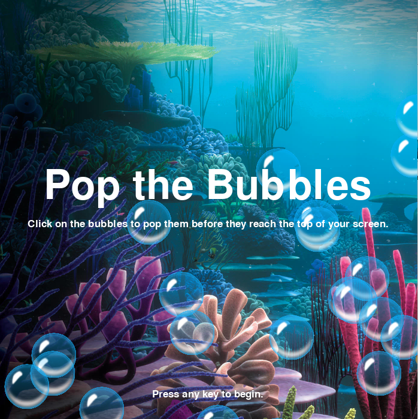
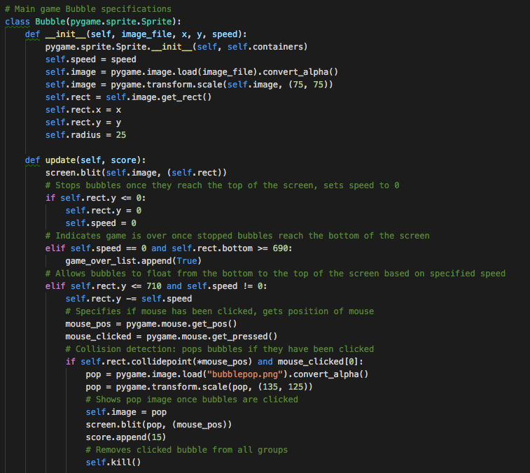
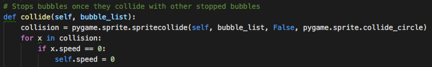
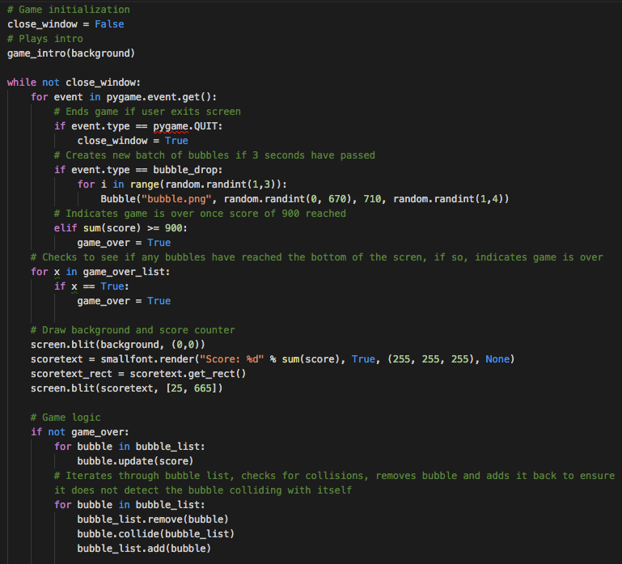
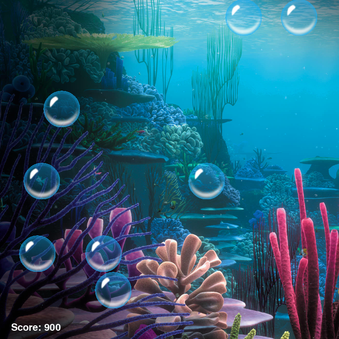
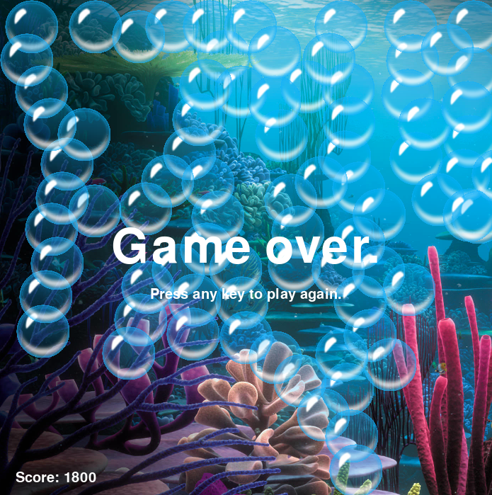

<h2><u>Overview:</u><h2>
<h5>Pop the Bubbles is a game written in Python utilizing Pygame. Using your mouse or trackpad, you must click on the bubbles to pop them before they reach the top of your screen. Once they fill you screen, you have lost the game! Each bubble is worth 15 points. You must earn 900 points to win each level. There are 3 levels total. The bubbles move faster and propagate more frequently in each subsequent level.</h5>

<h2><u>How to Download Python and Play the Game:</u><h2>
<h5>Go to this site: https://www.python.org/downloads/ to download Python. This Pygame was created using Python version 2.7.13.</h5>

<h5>After you have downloaded Python, either clone or download this repository. Finally, open your terminal in Mac or Command Prompt in Windows, change into this repository file in your terminal, and type: python popthebubbles.py </h5>

<h2>Code Snippets:</h2>

<h5>Intro screen for the game</h5>
 

<h5>Creation of bubble class</h5>
 

<h5>Logic for bubble collision. Bubbles will only stop moving if they collide with a stopped bubble, which prevents bubble jams.</h5>
 

<h5>Code for main game loop. Game will continue as long as score is under 900 and no stopped bubbles have reached the bottom of the screen. Also generates between 1-3 bubbles every 3 seconds (based on set timer for bubble drop event).</h5>
 

<h2>Screenshots:</h2>

<h5>Intro screen for the game</h5>
 

<h5>User must use their mouse to pop the bubbles during gameplay</h5>
 

<h5>The game ends when any stopped bubble reaches the bottom of your screen.</h5>
 
